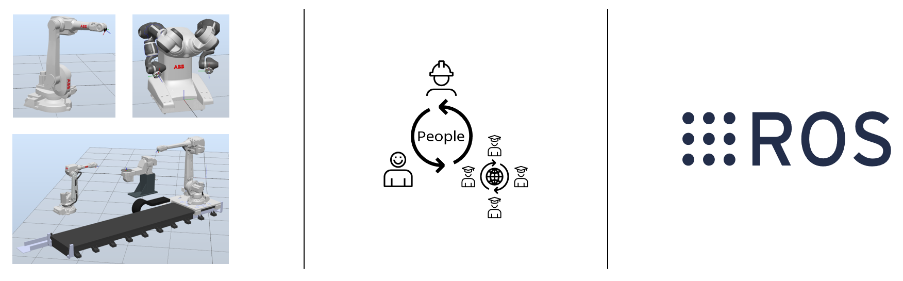

# abb_robot_driver


[](http://github.com/ros-industrial/abb_robot_driver/issues)

[](https://opensource.org/licenses/BSD-3-Clause)

[](http://rosindustrial.org/news/2016/10/7/better-supporting-a-growing-ros-industrial-software-platform)

**Please note that the included packages have not been productized, and that academia is the intended audience.**\
**The packages are provided "as-is", and as such no more than limited support can be expected.**

## Overview

ROS packages intended to ease interaction between ABB robot controllers and ROS-based systems, by providing *ready-to-run* ROS nodes.

<p align="center">
  
  <br>
  <i>Connecting ABB robots, people and ROS systems together.</i>
</p>

The included (*principal*) packages are briefly described in the following table:

| Package | Description |
| --- | --- |
| [abb_rws_state_publisher](abb_rws_state_publisher) | Provides a ROS node that continuously polls an ABB robot controller for system states, which then are parsed into ROS messages and published to the ROS system. |
| [abb_rws_service_provider](abb_rws_service_provider) | Provides a ROS node that exposes ROS services, for *discrete interaction* with an ABB robot controller, like starting/stopping the `RAPID` program and reading/writing of IO-signals. |
| [abb_egm_hardware_interface](abb_egm_hardware_interface) | Provides ROS nodes for:<br><ul><li>Running a [ros_control](http://wiki.ros.org/ros_control)-based hardware interface, for *direct motion control* of ABB robots (via the *Externally Guided Motion* (`EGM`) interface).</li><li>Automatically stopping `ros_control` controllers when `EGM` communication sessions ends *(a user-provided list can specify controllers that are ok to keep running*).</li></ul>***This package is only recommended for advanced users.*** |

Please see each package for more details (*e.g. additional requirements, limitations and troubleshooting*).

It is recommended to utilize the `RobotWare` [StateMachine Add-In](https://robotapps.robotstudio.com/#/viewApp/c163de01-792e-4892-a290-37dbe050b6e1) to ease the setup of the ABB robot controller system. The `StateMachine Add-In` is optional, however, without it, the driver nodes will only be able to provide basic interaction with ABB robots.

## Build Instructions

It is assumed that [ROS has been installed](http://wiki.ros.org/ROS/Installation) on the system in question.

*Note that the included packages have mainly been tested with ROS Melodic (on both Ubuntu and Windows).*

### catkin_tools

As some of the dependencies of this driver are plain CMake packages (instead of Catkin packages), they cannot be built using vanilla [catkin](http://wiki.ros.org/catkin), but require the use of either `catkin_make_isolated` or [catkin_tools](https://catkin-tools.readthedocs.io/en/latest).
The instructions in the rest of this section will assume `catkin_tools` will be used.
In case of using `catkin_make_isolated`, be sure to update commands where necessary.

As workspaces cannot be built with both vanilla `catkin` and `catkin_tools`, if you already have a workspace and would like to *add* the packages of this driver to that workspace, be sure to clean the workspace prior to building it, as you will encounter errors otherwise.

### vcstool

The instructions below assume [vcstool](https://github.com/dirk-thomas/vcstool) is installed.
Refer to [How to install vcstool?](https://github.com/dirk-thomas/vcstool#how-to-install-vcstool) in the `vcstool` readme for more information on how to install it on various OS.

### Building the Packages

The following instructions assume that a [Catkin workspace](http://wiki.ros.org/catkin/Tutorials/create_a_workspace) has been created at `$HOME/catkin_ws` and that the *source space* is at `$HOME/catkin_ws/src`. Update paths appropriately if they are different on the build machine.

The following instructions should build the main branches of all required repositories on a ROS Melodic system:

```bash
# Change to the root of the Catkin workspace.
cd $HOME/catkin_ws
mkdir -p src

# Use vcstool to clone all required repositories into the 'src' space.
vcs import src --input https://github.com/ros-industrial/abb_robot_driver/raw/master/pkgs.repos

# Check build dependencies.
# First update the local rosdep database.
rosdep update

# And then ask rosdep to install any missing dependencies for us.
# NOTE: This may install additional packages, depending on the software installed
#       on the machine. Be sure to check each command rosdep wants to run.
rosdep install --from-paths src --ignore-src --rosdistro melodic

# Finally build the workspace (using catkin_tools).
catkin build
```

If no errors were reported as part of the `catkin build` command, the build has succeeded and the driver should now be usable.

### Activating the Workspace

Finally, activate the workspace to get access to the packages just built:

```bash
$ source $HOME/catkin_ws/devel/setup.bash
```

At this point all packages should be usable (ie: `roslaunch` should be able to auto-complete package names starting with `abb_..`). In case the workspace contains additional packages (i.e.: not from this repository), those should also still be available.

## Bringup Examples

See [abb_robot_bringup_examples](abb_robot_bringup_examples) for some basic examples of how to configure, launch and use the included ROS nodes.

## Acknowledgements

### ROSIN Project

<p>
  <a href="http://rosin-project.eu">
    
  </a>
  The core development has been made within the European Union's Horizon 2020 project: ROSIN - ROS-Industrial Quality-Assured Robot Software Components (see http://rosin-project.eu for more info).
  <br><br>
  
  The ROSIN project has received funding from the European Union's Horizon 2020 research and innovation programme under grant agreement no. 732287.
</p>

*The opinions expressed here reflects only the author's view and reflects in no way the European Commission's opinions. The European Commission is not responsible for any use that may be made of the contained information.*

### Special Thanks

Special thanks to [gavanderhoorn](https://github.com/gavanderhoorn) for guidance with open-source practices and conventions.
